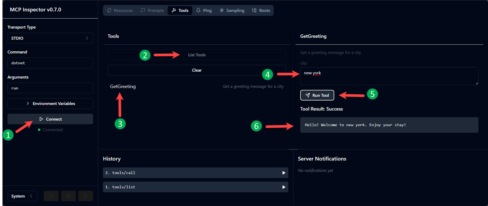

# Model Context Protocol (MCP) Server in C#
## Hello World Example

The Model Context Protocol (MCP) is an open standard for building context-aware AI applications by connecting language models with external data sources. This example demonstrates how to implement a basic MCP server in C# using the `modelcontextprotocol/csharp-sdk` library, which provides a streamlined API for creating and managing MCP servers.

## Prerequisites
- .NET SDK version 9.0
- npx (Node.js package runner) installed
- Visual Studio Code or any IDE

## Create a New Console Project

If you want to create the project from scratch, you can use the following commands to create a new console application and add the necessary dependencies.

```shell
dotnet new console -n MCPServer
cd MCPServer

dotnet add package ModelContextProtocol --version 0.1.0-preview.1.25171.12

dotnet add package Microsoft.Extensions.Hosting

# Add the MCPServer/Program.cs file to the location where you created the project.
```

## Trying out the MCP Server

First, build the project using the following command:

```shell
dotnet run
```

Then start the MCP server by running the following command in a separate terminal:

```shell
npx @modelcontextprotocol/inspector dotnet run
```

This command will start the MCP Inspector, which allows you to interact with the MCP server and test its functionality. You can use the Inspector to send requests to the server and receive responses based on the defined context.



1. Click on the "Connect" button to establish a connection with the MCP server.
2. Once connected, click list tools.
3. You should see the method name from the MCP server in the list of available tools.
4. Add a value for the argument 
5. Click "Run Tool".
6. The result will be displayed in the Inspector.
